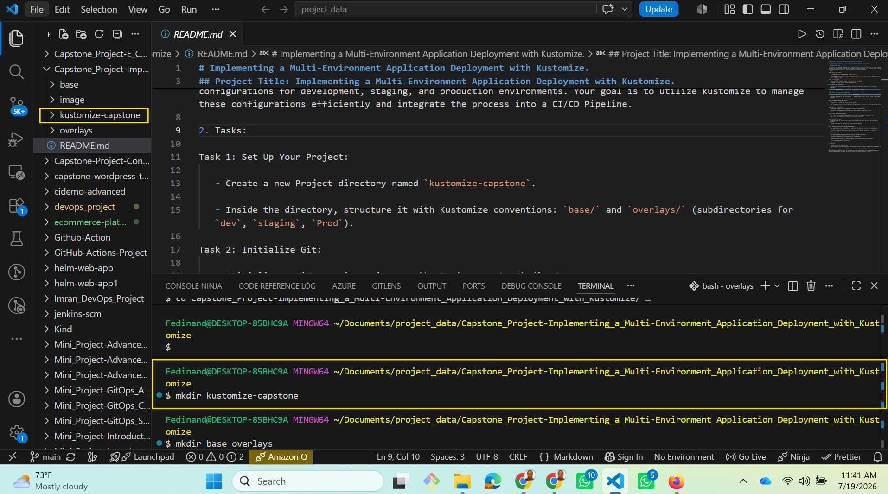
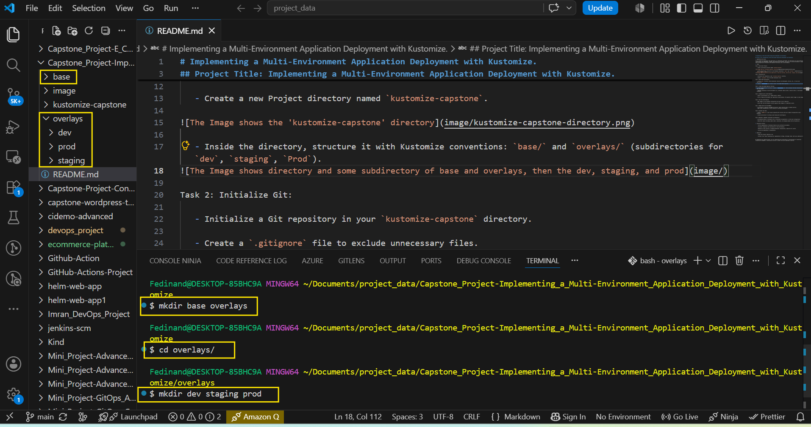
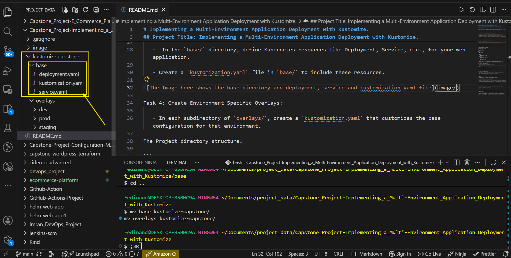

# Implementing a Multi-Environment Application Deployment with Kustomize.

## Project Title: Implementing a Multi-Environment Application Deployment with Kustomize.

1. Hypothetical Use Case:

You are tasked with deploying a web application in a Kubernetes environment. The application will have different configurations for development, staging, and production environments. Your goal is to utilize kustomize to manage these configurations efficiently and integrate the process into a CI/CD Pipeline.

2. Tasks:

Task 1: Set Up Your Project:

   - Create a new Project directory named `kustomize-capstone`.



   - Inside the directory, structure it with Kustomize conventions: `base/` and `overlays/` (subdirectories for `dev`, `staging`, `Prod`).


Task 2: Initialize Git:

   - Initialize a Git repository in your `kustomize-capstone` directory.

   - Create a `.gitignore` file to exclude unnecessary files. 

Task 3: Define Base Confirmation:

   -  In the `base/` directory, define Kubernetes resources like Deployment, Service, etc., for your web application.

   - Create a `kustomization.yaml` file in `base/` to include these resources.



Task 4: Create Environment-Specific Overlays:

   - In each subdirectory of `overlays/`, create a `kustomization.yaml` that customizes the base configuration for that environment.

   - Implement variations for each environment (e.g., different replica counts, resource limits, or environment variables).


The Project directory structure.

```
kustomize-eks-project/
│
├── base/
│   ├── deployment.yaml
│   ├── service.yaml
│   └── kustomization.yaml
│
└── overlays/
    ├── dev/
    │   ├── kustomization.yaml
    │   └── replica_count_dev.yaml
    │
    ├── staging/
    │   ├── kustomization.yaml
    │   └── replica_count_staging.yaml
    │
    └── prod/
        ├── kustomization.yaml
        └── replica_count_prod.yaml

```


Task 5: Integrate with a CI/CD Pipeline:

   - Choose a CI/CD Platform (e.g., GitHub Actions, Jenkins).

   - Set up a Pipeline that deploys your application using Kustomize. The pipeline should trigger on code changes.


Task 6: Test the CI/CD Pipeline:

   - Make changes in your Kustomize configurations and push to your repository.

   - Verify that the CI/CD Pipeline correctly applies these changes to a kubernetes cluster.
   
   The Image below is the is the structure of CI/CD configuration.

   ```
   Developer
    │
    ▼
git add .
git commit -m "Update application"
git push origin main
    │
    ▼
GitHub Repository
    │
    ▼
GitHub Actions starts automatically
    │
    ▼
Checkout Repository
    │
    ▼
Install kubectl
    │
    ▼
Install Kustomize
    │
    ▼
Authenticate to AWS
    │
    ▼
Connect to Amazon EKS
    │
    ▼
Build manifests with Kustomize
    │
    ▼
Deploy using kubectl apply -k overlays/prod
    │
    ▼
Amazon EKS
    │
    ▼
Deployment
    │
    ▼
ReplicaSet
    │
    ▼
Pods
    │
    ▼
Application Running
```

Task 7: Manage Secrets and ConfigMaps:

   - Use Kustomize to generate ConfigMaps and Secrets. Ensure sensitive data is handled securely.
   - Apply these configurations in your overlays for different environments.


Task 8: Document Your Work: 

   - Create a `README.md` in your project explaining the structure and how to deploy the application using Kustomize.

   - Include instructions for setting up and testing the CI/CD Pipeline.


Task 9 (Advanced): Implement Transformers and Generators:

   - Use advanced features of Kustomize such as transformers and generators to refine your configurations.

   - Demonstrate usage like adding common labels, annotations, and managing dynamic data with generators. 


3. Evaluation Criteria:

    - Correct implementation of Kustomize features across different environments.

    - Successful integration and functionality of the CI/CD Pipeline.

    - Adherence to best practices in managing Kubernetes configurations, especially for secrets.

    - Clarity and completeness of documentation.


4. Submission:

    - Submit your Project repository link.

    - Include a brief report explaining your implementation strategy, challenges faced, and how you addressed them.


By Completing this Capstone Project, you will demonstrate your proficiency in using Kustomize for Kubernetes configuration management, showcasing your ability to handle real-world deployment scenarios.

 